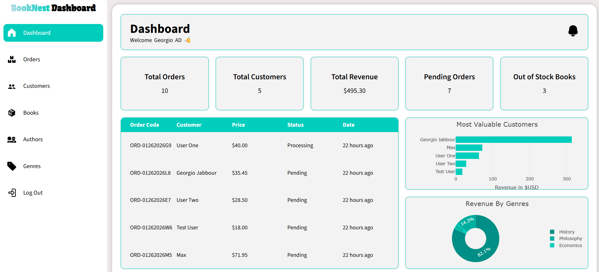

# BookNest

A full-stack web application for managing an online bookstore, featuring a comprehensive admin dashboard for inventory management, customer relations, and order processing.

## 🎯 Project Overview

**BookNest** is an e-commerce platform specifically designed for book retailers. The admin dashboard provides complete CRUD (Create, Read, Update, Delete) operations for managing books, authors, genres, customers, and orders. Built with a clean separation of concerns, the application demonstrates modern web development practices with server-side validation, client-side interactivity, and a responsive user interface.

## 🛠️ Tech Stack

### Backend

- **PHP 7.4+** - Server-side logic and API endpoints
- **MySQL** - Relational database management
  - Developed a database schema for the platform
  - Implemented the usage of **Indexes, Triggers, Junction Tables**
    to showcase my abilities,
- **XAMPP** - Local development environment (Apache server)

### Frontend

- **Vanilla JavaScript (ES6+)** - Modern JavaScript with ES6 modules
- **HTML5** - Semantic markup
- **CSS3** - Custom styling and responsive design

## 📊 BookNest Admin Dashboard

The **Admin Dashboard** is the core management system of the BookNest e-commerce platform. It is a fully custom-built internal tool designed to allow admins to **manage products, customers, orders, inventory** efficiently and safely.

To check in depth details about The Dashboard [Click Here](https://github.com/GeorgioIO/ecommerce/blob/main/frontend/admin/README.md)

## 📊 BookNest Storefront

**Under Construction**
